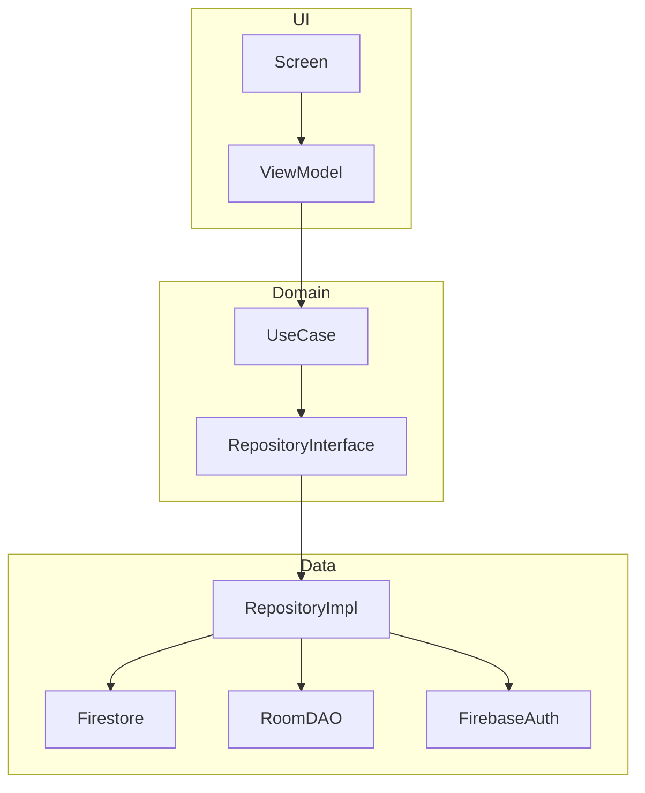

# Gestor Personal de Tareas (TaskManager)

Aplicación Android desarrollada con Jetpack Compose, Firebase y Room, siguiendo la arquitectura MVVM con Clean Architecture (Domain/Data/UI).

## Integrantes
- Juan Martinez Ramirez

## Tecnologías Implementadas
- **Kotlin & Jetpack Compose**: Interfaz de usuario declarativa.
- **Firebase Authentication**: Registro e inicio de sesión seguro.
- **Cloud Firestore**: Persistencia remota en tiempo real.
- **Room**: Almacenamiento local para borradores.
- **Hilt**: Inyección de dependencias.
- **Corrutinas & Flow/StateFlow**: Manejo de asincronía y estado de la UI.
- **Navigation Compose**: Sistema de navegación entre pantallas.

## Arquitectura
La aplicación está dividida en las siguientes capas:
1.  **Domain**: Modelos (`Task`, `TaskDraft`), Interfaces de Repositorio y Casos de Uso.
2.  **Data**: Implementaciones de Repositorio, base de datos Room (DAO, Entities), modelos de Firestore y Mappers.
3.  **UI**: Pantallas de Compose, ViewModels y estados de operación.
4.  **DI**: Módulos de Hilt para la provisión de dependencias globales.

### Diagrama de Arquitectura

## Instrucciones de Configuración
1.  Crear un proyecto en [Firebase Console](https://console.firebase.google.com).
2.  Registrar la aplicación con el ID: `com.example.firebaseroomyarquitecturamvvm`.
3.  Descargar el archivo `google-services.json` y colocarlo en la carpeta `app/`.
4.  Habilitar **Email/Password Auth** en Authentication.
5.  Habilitar **Cloud Firestore** y aplicar las reglas de seguridad provistas en `firestore.rules`.
6.  Sincronizar Gradle y ejecutar en un dispositivo con Google Play Services.

##Pruebas realizadas
Se realizaron pruebas de las funcionalidades principales de la aplicación:

Código	Caso de prueba
P01	Registro con datos válidos
P02	Registro con correo existente
P03	Inicio de sesión con contraseña incorrecta
P04	Cerrar y abrir la aplicación con sesión activa
P05	Cerrar sesión y utilizar el botón Atrás
P06	Crear, consultar, editar y eliminar una tarea
P07	Iniciar sesión con un segundo usuario
P08	Guardar un borrador y reiniciar la aplicación
P09	Publicar un borrador con conexión
P10	Intentar publicar un borrador cuando Firebase falla

## Estructura de Paquetes
- `data`: local (Room), remote (Firestore models), repository, mapper.
- `domain`: model, repository (interfaces), usecase.
- `ui`: navigation, screen (login, register, tasklist, taskform, drafts), state, theme.
- `di`: Módulos de Hilt.

## Funcionalidades Terminadas
- [x] Registro e Inicio de sesión (Firebase Auth).
- [x] Persistencia de sesión automática.
- [x] CRUD completo de tareas remotas (Cloud Firestore).
- [x] Filtrado de datos por usuario (ownerId).
- [x] Persistencia de borradores locales (Room).
- [x] Publicación segura de borradores a la nube.
- [x] Diálogos de confirmación para eliminación.
- [x] Manejo de estados de UI (Carga, Éxito, Vacío, Error).

## Errores Conocidos
1.Cierre inesperado en la pantalla de borradores: al acceder a la sección de borradores la aplicación se cerraba inesperadamente. Se identificó y corrigió el problema.

Capturas

##Alcance
El proyecto implementa las siguientes funcionalidades principales:

•Autenticación: Acceso seguro mediante Firebase Authentication.

•Gestión CRUD: Operaciones completas de creación, lectura, actualización y eliminación de tareas en la nube a través de Cloud Firestore.

•Persistencia Local: Administración de borradores en el dispositivo utilizando Room, permitiendo guardar información sin conexión inmediata.

